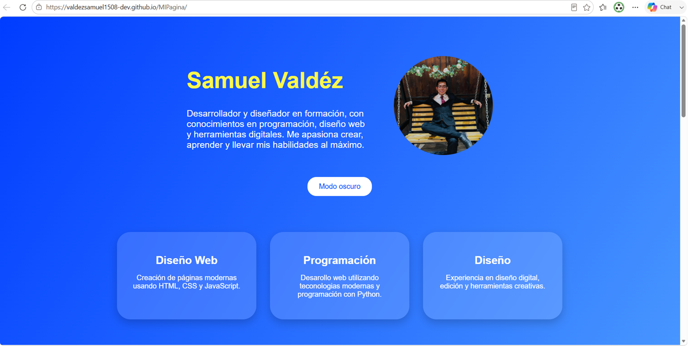

# Mi Portafolio

Este es mi portafolio personal desarrollado con HTML, CSS y JavaScript.

## 📷 Vista previa

## 🚀 Proyectos

### 🎵 Clon de Spotify
https://valdezsamuel1508-dev.github.io/MIPagina/spotify.html

### ☕ Café Monarca
https://valdezsamuel1508-dev.github.io/MIPagina/cafe.html

### 👨‍💻 Portafolio Personal
https://valdezsamuel1508-dev.github.io/MIPagina/

## Tecnologías

- HTML5
- CSS3
- JavaScript

## Sitio web

🔗 https://valdezsamuel1508-dev.github.io/MIPagina/

## Autor

Samuel Valdéz
